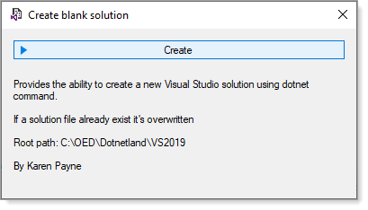

# About

Simple user interface for `dotnet` new sln hard-wired to a specific path.

:warning: Path is hardcode, feel free to modify or use appsettings.json

---

Visual Studio earlier versions provided an option to create a blank solution then in one or more updates this option has gone away. For those who are new to Visual Studio may want to create a new Visual Studio solution without any projects. 

This utility provides the ability to create a blank Visual Studio solution. There are two versions, one hard coded default path to select where to create a new solution folder while the other reads the default path from a json file.

Once a new solution has been created the folder is opened in Windows Explorer, the developer can then inspect and copy the folder path to use in Visual Studio to open the new blank solution.

Written using  .NET Framework 4.8 as some developers may not have moved to .NET Core yet

- See `using-json branch` for a version which stored the default selection path in `appsettings.json`

